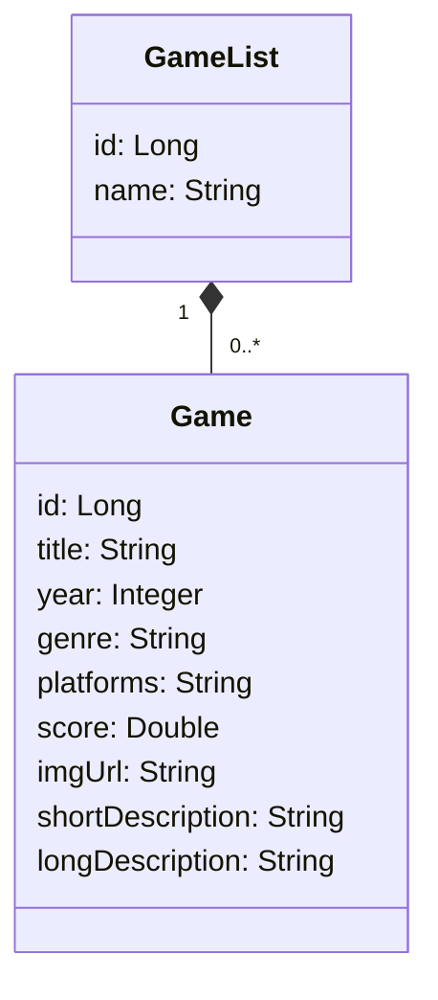

# Game List
## Descrição do Projeto

Uma API para gerenciar jogos, com descrições sobre cada um e listas.

## Tecnologias Utilizadas

- Java
- Spring Boot
- JPA / Hibernate
- MySQL
- Maven

## Modelo conceitual


# Como executar o projeto

## Pré-requisitos: Java 17

```bash
# Clonar repositório
git clone https://github.com/guilbercorreia/Game-List.git

# Entrar na pasta do projeto
cd Game-list

# Executar o projeto
./mvnw spring-boot:run
```
# Autor
Guilber Correia

https://www.linkedin.com/in/guilber-correia/
